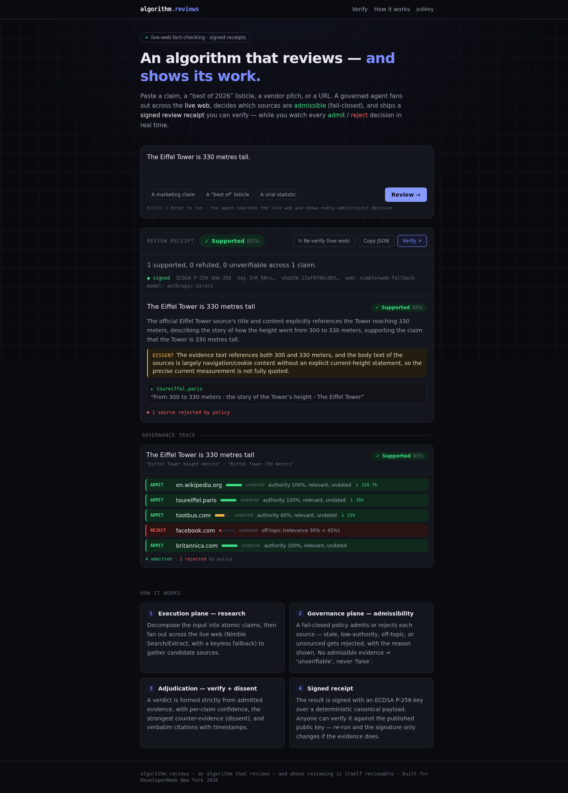
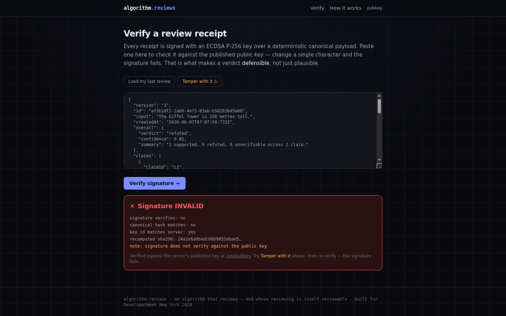

# algorithm.reviews — The Agent Trust Layer

**An algorithm that reviews — and whose reviewing is itself reviewable.**

Live: <https://algorithm-reviews.vercel.app> · Try it with zero setup at
[`/demo/claude-context`](https://algorithm-reviews.vercel.app/demo/claude-context).

Paste a claim, a "best X of 2026" listicle, a vendor pitch, or a URL. A *governed*
agent fans out across the **live web**, decides which sources are **admissible**
(fail-closed), forms a verdict grounded only in admitted evidence, and ships a
**signed review receipt** — verdict, per-claim confidence, timestamped citations,
dissent, and an **ECDSA signature** anyone can verify. You watch every
**admit / reject** decision stream in real time.

Built for the **DeveloperWeek New York 2026 Hackathon**. One project, three
challenges: **Overall**, **Nimble** (live web), **name.com Domain Roulette**
(`algorithm.reviews`).

---

## Screenshots

A live review — the signed receipt plus the streaming admit/reject governance trace:



Tamper-evidence — flip one field and the ECDSA signature fails at `/verify`:



---

## Why it exists

AI answers and online reviews are **unauditable**: you can't tell a grounded
verdict from a hallucinated one, sources are stale or fabricated, and "AI
fact-checkers" are themselves black boxes. Buyers, journalists, compliance, and
due-diligence teams need a verdict they can **defend** — a citation trail and a
timestamp, not a vibe.

algorithm.reviews is a **two-plane architecture** compressed into one legible
product:

- **Execution plane** — searches and extracts live web evidence.
- **Governance plane** — decides what evidence is *admissible* (fail-closed),
  adjudicates the verdict, and signs the receipt.

The governance is the spectacle: you see, live, which sources were **admitted
(green)** and **rejected (red)**, and *why*.

## How it works

```text
Input → [decompose into atomic claims]
      → [search the live web]                          (execution plane)
      → [ADMIT / REJECT each source, fail-closed]       (governance plane)  ◀ the differentiator
      → [extract admitted sources]
      → [verify + dissent in one pass]                  (governance plane)
      → [signed review receipt + ECDSA signature]
```

- **Fail-closed:** a claim with no admissible evidence resolves to
  **"unverifiable"**, never "false". Absence of proof ≠ proof of absence.
- **Hard caps in code** (≤3 claims, ≤2 queries/claim, ≤8 extracts, concurrency 2)
  keep every run inside web-provider rate limits and the serverless function
  budget. See [`lib/agent/caps.ts`](./lib/agent/caps.ts).
- **Deterministic, signed receipts:** the signature covers a canonical payload
  that *excludes* volatile fields (timestamps, ordering), so re-running only
  changes the signature when the **evidence** changes. Tamper with a verdict or a
  quote and verification fails — try it at `/verify`.

## What's working today

Every feature below is live at the deployed URL and demoable with no keys.

- **Streaming governed review** — `POST /api/review` runs the full pipeline and
  streams `application/x-ndjson`, so the UI renders each admit/reject decision as
  it happens (`X-Accel-Buffering: no` defeats CDN buffering on Vercel).
- **Signed receipts + public verification** — `GET /api/pubkey` publishes the
  ECDSA P-256 public key; `POST /api/verify` (and the `/verify` page) recompute
  the canonical payload and check the signature. Tamper detection is exercised by
  the test suite.
- **Offline demo fixtures** — `/demo/claude-context`, `/demo/nimble-best`,
  `/demo/link-rot` force the mock provider and mock model (zero network), so they
  can never rate-limit or 500 on stage.
- **Keyless live web** — when `NIMBLE_API_KEY` is absent, search falls back to the
  Wikipedia API first (real, keyless, reachable from a datacenter IP), then Jina
  (with key) or DuckDuckGo HTML. Live reviews work from a fresh clone.
- **Zero-key build/test/demo** — the model layer resolves Anthropic key → Vercel
  AI Gateway (OIDC) → deterministic mock, so the app builds and tests with no
  secrets.

## Known limitations

- **Caps are tight on purpose.** A run is bounded to ≤3 claims and ≤8 total
  extractions to stay inside the serverless budget and provider rate limits, so a
  long listicle is sampled, not exhaustively checked.
- **Keyless web is best-effort.** Without a Nimble key, breadth depends on
  Wikipedia + DuckDuckGo HTML scraping, which is thinner and can be flaky for
  niche claims. Nimble is the primary provider for full coverage.
- **Single signing key per deployment.** With no `RECEIPT_SIGNING_JWK`, an
  ephemeral key is generated per process; cross-instance verification requires a
  stable key (`node scripts/gen-key.mjs`).
- **No CI workflow and no license file yet** — see [Repo notes](#repo-notes).

## Stack

Next.js 16 (App Router) · React 19 · Tailwind v4 · TypeScript · Vercel AI SDK 6 ·
Anthropic Claude (Opus for adjudication, Haiku for classification) · Nimble live
web · Web Crypto ECDSA P-256 · Vitest · deployed on Vercel.

The **web layer** is a swappable `WebProvider`: Nimble primary, keyless
Wikipedia/Jina/DuckDuckGo fallback, and a deterministic mock — so the app builds,
tests, and demos offline, and degrades gracefully on stage instead of
hard-failing.

The **model layer** resolves `Anthropic key → Vercel AI Gateway (OIDC) → mock`,
so it runs with zero keys (mock) and goes fully live the instant a key or the
gateway is available — no code change.

## Run it

```bash
npm install
cp .env.example .env.local      # optional — works with no keys (mock mode)
npm run dev                     # http://localhost:3000
```

Offline demo fixtures (zero external calls, guaranteed): `/demo/claude-context`,
`/demo/nimble-best`, `/demo/link-rot`.

### Quality gates

```bash
npm run typecheck   # tsc --noEmit
npm run lint        # eslint
npm test            # vitest — 19 tests across governance, canonicalization/signing, reducer
npm run build       # next build
```

The 19 tests cover the admissibility policy (including the stale-but-high-authority
override and fail-closed-on-no-content), receipt signing / tamper detection /
determinism, and the UI state reducer.

### Environment

See [`.env.example`](./.env.example). Nothing is required (mock mode). For live
runs:

| Variable | Purpose |
|---|---|
| `NIMBLE_API_KEY` | Primary live-web provider (5,000 free credits). Optional — keyless fallback works without it. |
| `ANTHROPIC_API_KEY` | Direct Claude access. Optional if the Vercel AI Gateway is available. |
| `AI_GATEWAY_API_KEY` | Local live runs through the AI Gateway (automatic in production on Vercel via OIDC). |
| `JINA_API_KEY` | Optional — enables `s.jina.ai` search in the keyless fallback. |
| `RECEIPT_SIGNING_JWK` | Stable ECDSA P-256 signing key for cross-instance verification. Generate with `node scripts/gen-key.mjs`. |
| `MODEL_MODE` | `auto` \| `live` \| `mock` — override model resolution. |
| `WEB_PROVIDER` | `auto` \| `nimble` \| `jina` \| `mock` — override web provider selection. |

Never commit real values; `.env.local` is gitignored.

## API

| Endpoint | Method | Description |
|---|---|---|
| `/api/review` | POST | Runs the governed pipeline, streams `application/x-ndjson` events (`{ input: string }` body). |
| `/api/verify` | POST | Recomputes the canonical payload and verifies a receipt's ECDSA signature. |
| `/api/pubkey` | GET | Returns the published ECDSA P-256 public key (JWK). |

## Verify a receipt yourself

Every receipt is signed with ECDSA P-256. The public key is published at
`/api/pubkey`. `POST /api/verify` (or the `/verify` page) recomputes the
canonical payload and checks the signature. Change one character → it fails.

## Project structure

```text
app/        Next.js App Router — pages (/, /verify, /demo/[id]) + API routes
components/ React UI for the review console and receipt rendering
lib/agent/  pipeline, governance policy, caps, model resolution
lib/web/    swappable WebProvider (nimble, jina, mock) + fallback wiring
lib/receipt/ canonicalization + ECDSA signing/verification
lib/fixtures/ offline demo inputs
scripts/    gen-key.mjs — ECDSA signing key generator
tests/      vitest suites (governance, receipt, reduce)
docs/       DESIGN.md and screenshots
```

## Deploy

Deployed on Vercel from this repo. The model layer uses the Vercel AI Gateway via
OIDC in production (no raw Anthropic key required), and the review route sets
`maxDuration = 300` for the multi-step agent.

## Design

The full design doc, including the adversarial review that shaped it, is in
[`docs/DESIGN.md`](./docs/DESIGN.md).

## Repo notes

No `LICENSE` file is present yet, so reuse terms are unspecified — add one before
treating this as open source. There is no CI workflow; the quality gates above are
run locally (`npm test`, `npm run typecheck`, `npm run lint`).
